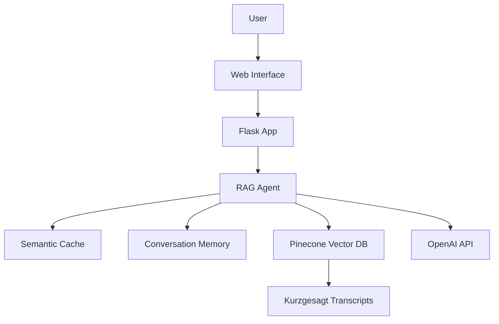

# 🧬 Kurzgesagt AI Assistant

A modern, multilingual chatbot powered by RAG (Retrieval-Augmented Generation) technology that answers science questions based on Kurzgesagt video transcripts.

  

## ✨ Features

- **🌍 Multilingual Support**: Ask questions in any language, get answers in the same language
- **🧠 Smart Conversation Memory**: Remembers context for follow-up questions
- **⚡ Semantic Caching**: Intelligent response caching for faster answers
- **📚 Source Attribution**: Shows which Kurzgesagt videos were used for answers
- **🎨 Modern UI**: Beautiful, responsive chat interface inspired by modern chatbots
- **📱 Mobile Friendly**: Works perfectly on all devices

## 🚀 Quick Start

### Prerequisites

1. **Python 3.8+**
2. **OpenAI API Key** - Get one from [OpenAI Platform](https://platform.openai.com/api-keys)
3. **Pinecone API Key** - Get one from [Pinecone](https://app.pinecone.io/)

### Installation

1. **Clone and setup:**
```bash
git clone <your-repo-url>
cd Final_project_Ironhack
pip install -r requirements.txt
```

2. **Create environment file:**
```bash
# Create .env file with your API keys
echo "OPENAI_API_KEY=your-openai-key-here" > .env
echo "PINECONE_API_KEY=your-pinecone-key-here" >> .env
echo "PINECONE_ENVIRONMENT=gcp-starter" >> .env
echo "FLASK_SECRET_KEY=your-secret-key-here" >> .env
```

3. **Upload data to Pinecone (first time only):**
```bash
cd code
python openai_pinecone_uploader.py
```

4. **Start the web application:**
```bash
python app.py
```

5. **Open your browser to:**
```
http://localhost:5000
```

## 🏗️ Project Structure

```
Final_project_Ironhack/
├── app.py                 # Flask web application
├── requirements.txt       # Python dependencies
├── .env                  # Environment variables (create this)
├── .gitignore           # Git ignore rules
├── README.md            # This file
│
├── code/                # Core application code
│   ├── kurzgesagt_rag_agent.py      # Main RAG agent
│   ├── context_retriever.py         # Context retrieval logic
│   ├── language_utils.py            # Language detection & translation
│   ├── semantic_cache.py            # Intelligent caching
│   ├── simple_conversation_memory.py # Conversation memory
│   ├── openai_pinecone_uploader.py  # Data upload utility
│   └── ...
│
├── static/              # Web assets
│   ├── css/
│   │   └── style.css   # Modern UI styles
│   └── js/
│       └── chat.js     # Chat interface logic
│
├── templates/
│   └── index.html      # Main chat interface
│
├── data/
│   └── pinecone_data.json # Vector database backup
│
└── transcripts/        # Kurzgesagt video transcripts
    ├── What_are_black_holes_transcript.txt
    ├── How_the_immune_system_works_transcript.txt
    └── ...
```

## 🎯 Usage Examples

### Web Interface
1. Open http://localhost:5000
2. Type any science question: 
   - "What are black holes?"
   - "¿Cómo funciona el sistema inmunológico?" (Spanish)
   - "Comment les dinosaures sont-ils morts?" (French)
3. Get intelligent, source-attributed answers!

### API Endpoints

**Ask a Question:**
```bash
curl -X POST http://localhost:5000/ask \
  -H "Content-Type: application/json" \
  -d '{"question": "What are black holes?", "session_id": "user123"}'
```

**Get Conversation Context:**
```bash
curl "http://localhost:5000/conversation/context?session_id=user123"
```

**Clear Conversation:**
```bash
curl -X POST http://localhost:5000/conversation/clear \
  -H "Content-Type: application/json" \
  -d '{"session_id": "user123"}'
```

## 🛠️ Configuration

### Environment Variables

| Variable | Description | Example |
|----------|------------|---------|
| `OPENAI_API_KEY` | OpenAI API key | `sk-...` |
| `PINECONE_API_KEY` | Pinecone API key | `your-key` |
| `PINECONE_ENVIRONMENT` | Pinecone environment | `gcp-starter` |
| `FLASK_SECRET_KEY` | Flask session key | `random-secret` |

### Customization

- **UI Theme**: Edit `static/css/style.css`
- **RAG Parameters**: Modify `code/kurzgesagt_rag_agent.py`
- **Memory Settings**: Adjust conversation memory in the agent
- **Cache Settings**: Configure semantic cache similarity threshold

## 📊 System Architecture



## 🔧 Advanced Features

### Conversation Memory
- Remembers last 4 Q&A pairs per session
- Detects follow-up questions automatically
- Provides context-aware responses

### Semantic Caching
- 90% similarity threshold for cache hits
- Reduces API calls and improves response time
- Intelligent question matching

### Multilingual Support
- Automatic language detection
- Translation for retrieval in English
- Response in original question language

## 🚀 Deployment

### Local Development
```bash
python app.py
```

### Production (Gunicorn)
```bash
pip install gunicorn
gunicorn -w 4 -b 0.0.0.0:5000 app:app
```

### Docker (Optional)
```dockerfile
FROM python:3.9-slim
WORKDIR /app
COPY requirements.txt .
RUN pip install -r requirements.txt
COPY . .
EXPOSE 5000
CMD ["python", "app.py"]
```

## 🤝 Contributing

1. Fork the repository
2. Create a feature branch: `git checkout -b feature/amazing-feature`
3. Commit changes: `git commit -m 'Add amazing feature'`
4. Push to branch: `git push origin feature/amazing-feature`
5. Open a Pull Request

## 📝 License

This project is licensed under the MIT License - see the LICENSE file for details.

## 🙏 Acknowledgments

- **Kurzgesagt** for creating amazing educational content
- **OpenAI** for GPT and embedding models
- **Pinecone** for vector database services
- **LangChain** for RAG framework

## 📞 Support

If you encounter any issues:

1. Check the [Issues](https://github.com/your-repo/issues) page
2. Ensure all API keys are correctly set
3. Verify that data has been uploaded to Pinecone
4. Check server logs for detailed error messages

---

**Made with ❤️ for science education**