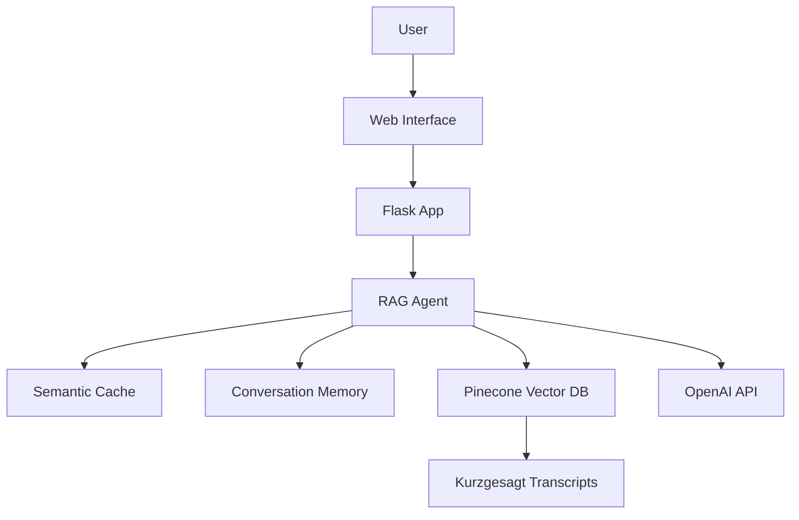

# 🧬 Kurzgesagt AI Assistant

A modern, multilingual chatbot powered by Retrieval-Augmented Generation (RAG) technology that answers science questions based on Kurzgesagt video transcripts.

---

## ✨ Features

- 🌍 **Multilingual Support**: Ask questions in any language, get answers in the same language
- 🧠 **Smart Conversation Memory**: Remembers context for follow-up questions
- ⚡ **Semantic Caching**: Intelligent response caching for faster answers
- 📚 **Source Attribution**: Shows which Kurzgesagt videos were used for answers
- 🎨 **Modern UI**: Beautiful, responsive chat interface inspired by modern chatbots
- 📱 **Mobile Friendly**: Works perfectly on all devices
- 🛠️ **Modular Tool Exposure**: Agent tools are exposed as modular functions for easy extension and evaluation

---

## 🏗️ Project Structure & File Descriptions

```
Final_project_Ironhack/
├── app.py                  # Flask web application: API endpoints, session management, and app launch
├── requirements.txt        # Python dependencies
├── .env                   # Environment variables (API keys, secrets, etc.)
├── .gitignore             # Git ignore rules
├── README.md              # Project documentation (this file)
├── Kurzgesagt Q&A Agent.pdf    # Final presentation of the project in pdf format
│
├── src/                   # Core application code
│   ├── kurzgesagt_rag_agent.py        # Main RAG agent: orchestrates retrieval, memory, caching, and tool exposure
│   ├── context_retriever.py           # Context retrieval logic: finds relevant transcript chunks
│   ├── language_utils.py              # Language detection & translation utilities
│   ├── semantic_cache.py              # Semantic cache: stores/retrieves similar Q&A pairs
│   ├── simple_conversation_memory.py  # Conversation memory: tracks session Q&A history
│   ├── openai_pinecone_uploader.py    # Utility to upload transcript data to Pinecone
│   ├── batch_audio_downloader.py      # (Optional) Download audio files in batch for TTS
│   ├── interactive_modes.py           # (Optional) Interactive chat modes logic
│   ├── simple_processor.py            # (Optional) Simple text processing utilities
│   └── __init__.py                    # Marks src as a Python package
│
├── static/                # Web assets
│   ├── css/
│   │   └── style.css      # Modern UI styles for the chat interface
│   └── js/
│       └── chat.js        # Frontend chat logic (AJAX, UI updates)
│   └── audio/             # Audio files for TTS playback (burp audio file for Rick's mode)
│
├── templates/
│   └── index.html         # Main chat interface (HTML, links to JS/CSS)
│
├── data/
│   └── pinecone_data.json # Pinecone vector DB backup (for restoring embeddings)
│
├── evaluation/            # (Optional) Evaluation scripts and results
│   ├── giskard_evaluation.py          # Automated evaluation script
│   ├── giskard_evaluation_results.csv # Evaluation results (CSV)
│   ├── giskard_evaluation_results.xlsx# Evaluation results (Excel with comments after manual review)
│   └── giskard_evaluation.log         # Evaluation logs
│
└── transcripts/           # Kurzgesagt video transcripts (plain text)
    ├── What_are_black_holes_transcript.txt
    ├── How_the_immune_system_works_transcript.txt
    └── ...                # Many more transcript files
```

---

## 📚 Methodologies Used

- **Retrieval-Augmented Generation (RAG):**
  - Combines context retrieval (from vector DB) with generative AI (OpenAI GPT) for grounded, source-attributed answers.
- **Semantic Caching:**
  - Uses vector similarity to cache and retrieve previous Q&A pairs, reducing latency and API usage.
- **Conversation Memory:**
  - Maintains a rolling window of Q&A pairs per session for context-aware, multi-turn conversations.
- **Multilingual Support:**
  - Detects question language, translates for retrieval, and returns answers in the original language.
- **Tool Exposure:**
  - Agent exposes major functions as modular tools (e.g., retrieval, memory, cache) for easy extension and evaluation.
- **Structured Output Parsing:**
  - Ensures answers follow a consistent, parseable format (answer, sources, confidence, etc.).
- **Source Attribution:**
  - Each answer includes references to the specific Kurzgesagt videos used.

---

## 🧰 Libraries & Technologies

- **Flask**: Web server and API endpoints
- **OpenAI**: GPT models for answer generation and embeddings
- **Pinecone**: Vector database for semantic search and retrieval
- **LangChain**: RAG orchestration and memory utilities
- **tqdm**: Progress bars for data upload scripts
- **NumPy**: Vector operations
- **scikit-learn**: (Optional) Similarity calculations
- **langdetect**: Language detection
- **Requests**: HTTP requests (API calls)
- **Jinja2**: HTML templating (via Flask)
- **JavaScript (AJAX)**: Frontend chat logic
- **HTML/CSS**: Responsive, modern UI

---

## 🚀 Quick Start

### Prerequisites

1. **Python 3.11** (With Python 3.13 there are conflicts with some libraries)
2. **OpenAI API Key** - Get one from [OpenAI Platform](https://platform.openai.com/api-keys)
3. **Pinecone API Key** - Get one from [Pinecone](https://app.pinecone.io/)

### Installation

1. **Clone and setup:**
```bash
git clone <your-repo-url>
cd Final_project_Ironhack
pip install -r requirements.txt
```

2. **Create environment file:**
```bash
# Create .env file with your API keys
echo "OPENAI_API_KEY=your-openai-key-here" > .env
echo "PINECONE_API_KEY=your-pinecone-key-here" >> .env
echo "PINECONE_ENVIRONMENT=gcp-starter" >> .env
echo "FLASK_SECRET_KEY=your-secret-key-here" >> .env
```

3. **Upload data to Pinecone (first time only):**
```bash
cd src
python openai_pinecone_uploader.py
```

4. **Start the web application:**

To test the agent locally, run the app.py file or run the start.bat script. 

```bash
python app.py
```

5. **Open your browser to:**
```
http://localhost:5000
```

---

## 🎯 Usage Examples

### Web Interface
1. Open http://localhost:5000
2. Type any science question: 
   - "What are black holes?"
   - "¿Cómo funciona el sistema inmunológico?" (Spanish)
   - "Comment les dinosaures sont-ils morts?" (French)
3. Get intelligent, source-attributed answers!

### API Endpoints

**Ask a Question:**
```bash
curl -X POST http://localhost:5000/ask \
  -H "Content-Type: application/json" \
  -d '{"question": "What are black holes?", "session_id": "user123"}'
```

**Get Conversation Context:**
```bash
curl "http://localhost:5000/conversation/context?session_id=user123"
```

**Clear Conversation:**
```bash
curl -X POST http://localhost:5000/conversation/clear \
  -H "Content-Type: application/json" \
  -d '{"session_id": "user123"}'
```

---

## 🛠️ Configuration

### Environment Variables

The `.env` file should be created in the project root and contain the following variables:

| Variable | Description | Example |
|----------|------------|---------|
| `OPENAI_API_KEY` | OpenAI API key | `sk-...` |
| `PINECONE_API_KEY` | Pinecone API key | `your-key` |
| `PINECONE_ENVIRONMENT` | Pinecone environment | `gcp-starter` |
| `FLASK_SECRET_KEY` | Flask session key | `random-secret` |

### Customization

- **UI Theme**: Edit `static/css/style.css`
- **RAG Parameters**: Modify `src/kurzgesagt_rag_agent.py`
- **Memory Settings**: Adjust conversation memory in the agent
- **Cache Settings**: Configure semantic cache similarity threshold

---

## 📊 System Architecture



---

## 🔧 Advanced Features

### Conversation Memory
- Remembers last 4 Q&A pairs per session
- Detects follow-up questions automatically
- Provides context-aware responses

### Semantic Caching
- 90% similarity threshold for cache hits
- Reduces API calls and improves response time
- Intelligent question matching

### Multilingual Support
- Automatic language detection
- Translation for retrieval in English
- Response in original question language

### Tool Exposure
- Agent exposes major functions (retrieval, memory, cache, etc.) as modular tools for easy extension and evaluation

### Structured Output Parsing
- Answers follow a consistent, parseable format (answer, sources, confidence, etc.)

---

## 🤝 Contributing

1. Fork the repository
2. Create a feature branch: `git checkout -b feature/amazing-feature`
3. Commit changes: `git commit -m 'Add amazing feature'`
4. Push to branch: `git push origin feature/amazing-feature`
5. Open a Pull Request

---


## 🙏 Acknowledgments

- **Kurzgesagt** for creating amazing educational content
- **OpenAI** for GPT and embedding models
- **Pinecone** for vector database services
- **LangChain** for RAG framework

---

## 📞 Support

If you encounter any issues:

1. Ensure all API keys are correctly set in your `.env` file
2. Verify that data has been uploaded to Pinecone
3. Check server logs for detailed error messages

---

**Made with ❤️ for science education and Ironhack's AI Engineering Bootcamp**